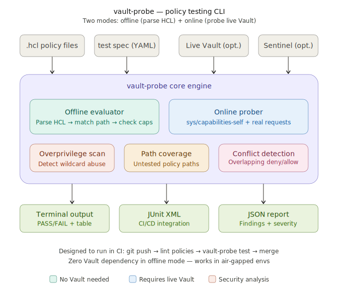

# Custos

**The missing `terraform plan` for HashiCorp Vault policies.**

custos (lat. guardian) is a CLI tool that lets you write test specifications for your Vault ACL policies, run them offline or against a live Vault instance, and catch misconfigurations, overprivileged access, and policy conflicts — all before they reach production.



```
$ custos test -f payment-svc.spec.yaml

  payment-service-policies

    OK payment service can read its own secrets          (secret/data/payment-svc/db-creds)
    OK payment service cannot read billing secrets       (secret/data/billing-svc/api-key)
    OK payment service cannot delete anything            (secret/data/payment-svc/*)
    OK payment service can issue short-lived certs       (pki_int/issue/payment-svc)
    FAIL no access to sys backend                          (sys/seal)
      → expected: deny, got: allow via policy "admin-legacy" (line 14)

  4 passed · 1 failed · 0 skipped

  Security findings:
    WARN  wildcard path "secret/*" grants [create read update delete list] in admin-legacy.hcl:8
    WARN  sudo capability outside sys/ found in admin-legacy.hcl:14
    INFO  policy path coverage: 5/12 paths tested (41%) — consider adding more tests

```

## Why

Every Vault customer hits the same wall: policies are written in HCL, applied to Vault, and then manually tested by creating tokens and running `vault kv get`. There is no structured way to answer *"if I apply this policy, can entity X access path Y?"* without deploying it live.

This creates real problems:

- **No pre-merge validation** — policy changes go through code review but nobody can verify correctness until they hit Vault
- **No regression testing** — a policy refactor might silently grant access to paths that should be denied
- **No security analysis** — wildcard paths, sudo leaks, and policy escalation vectors hide in plain sight
- **No CI integration** — Terraform can plan infrastructure changes, but there is no equivalent for Vault ACL policies

custos fills this gap.

## Features

### Offline policy evaluation (no Vault required)

Parse `.hcl` policy files locally, build the same evaluation tree Vault uses internally, and test assertions without any network access. Run policy tests in CI, in air-gapped environments, or on a laptop during development.

```bash
custos test -f myapp.spec.yaml
```

### Online verification against live Vault

Connect to a running Vault instance and use `sys/capabilities` to verify actual token and entity permissions. Catches things the offline evaluator cannot: Sentinel policy effects, identity group inheritance, namespace chroot behavior, and response wrapping constraints.

```bash
custos test -f myapp.spec.yaml --vault-addr=$VAULT_ADDR --vault-token=$VAULT_TOKEN
```

### Security scanning

Analyze policies for dangerous patterns without writing any test spec. Detects overprivileged access, wildcard abuse, policy escalation vectors, and conflicting deny/allow rules.

```bash
custos scan policies/*.hcl
```

### Policy composition

Test the combined effect of multiple policies attached to a single entity — which is how Vault actually works in production. Capabilities are merged across policies, deny overrides allow, and the most specific path wins.

```yaml
policies:
  - path: policies/base-readonly.hcl
  - path: policies/payment-svc.hcl
  - path: policies/team-platform.hcl
```

### CI/CD-ready output

JUnit XML for Jenkins/GitLab, JSON for custom tooling, and colored terminal output for humans.

```bash
custos test -f myapp.spec.yaml --format=junit > results.xml
custos test -f myapp.spec.yaml --format=json > results.json
```

## Installation

### From source (requires Go 1.22+)

```bash
go install github.com/timkrebs/custos/cmd/custos@latest
```

### From release binaries

Download the latest release for your platform from the [Releases](https://github.com/timkrebs/custos/releases) page.

### Homebrew (macOS/Linux)

```bash
brew install timkrebs/tap/custos
```

## Quick start

### 1. Write a policy

```hcl
# policies/payment-svc.hcl
path "secret/data/payment-svc/*" {
  capabilities = ["read", "list"]
}

path "secret/data/billing-svc/*" {
  capabilities = ["deny"]
}

path "pki_int/issue/payment-svc" {
  capabilities = ["create", "update"]
}

path "transit/encrypt/payment-key" {
  capabilities = ["update"]
}

path "transit/decrypt/payment-key" {
  capabilities = ["update"]
}
```

### 2. Write a test spec

```yaml
# payment-svc.spec.yaml
suite: "payment-service-policies"

policies:
  - path: policies/payment-svc.hcl

tests:
  # --- Secrets access ---
  - name: "can read its own secrets"
    path: "secret/data/payment-svc/db-creds"
    capabilities: [read]
    expect: allow

  - name: "can list its own secret keys"
    path: "secret/data/payment-svc/"
    capabilities: [list]
    expect: allow

  - name: "cannot write to its own secrets"
    path: "secret/data/payment-svc/db-creds"
    capabilities: [create, update]
    expect: deny

  - name: "cannot read billing secrets"
    path: "secret/data/billing-svc/api-key"
    capabilities: [read]
    expect: deny

  # --- PKI ---
  - name: "can issue certificates"
    path: "pki_int/issue/payment-svc"
    capabilities: [create, update]
    expect: allow

  - name: "cannot issue certs for other services"
    path: "pki_int/issue/billing-svc"
    capabilities: [create, update]
    expect: deny

  # --- Transit ---
  - name: "can encrypt with payment key"
    path: "transit/encrypt/payment-key"
    capabilities: [update]
    expect: allow

  - name: "cannot access other transit keys"
    path: "transit/encrypt/billing-key"
    capabilities: [update]
    expect: deny

  # --- Boundaries ---
  - name: "no sys access"
    path: "sys/seal"
    capabilities: [sudo]
    expect: deny

  - name: "no auth method management"
    path: "auth/token/create"
    capabilities: [create]
    expect: deny

# Optional: security analysis configuration
analyze:
  - check: overprivilege
    warn_on:
      - wildcard_paths      # "secret/*" with broad capabilities
      - sudo_capability     # sudo outside of sys/ admin paths
      - root_token_create   # auth/token/create with no_parent
      - policy_escalation   # sys/policy/* with update

  - check: coverage
    min_coverage: 80%       # percentage of policy paths with test assertions

  - check: conflicts
    severity: warning       # flag overlapping deny/allow across composed policies
```

### 3. Run tests

```bash
$ custos test -f payment-svc.spec.yaml
```

### 4. Add to CI pipeline

```yaml
# .github/workflows/vault-policies.yml
name: Vault policy tests
on:
  pull_request:
    paths: ['policies/**', '*.spec.yaml']

jobs:
  test:
    runs-on: ubuntu-latest
    steps:
      - uses: actions/checkout@v4

      - name: Install custos
        run: go install github.com/timkrebs/custos/cmd/custos@latest

      - name: Run policy tests (offline)
        run: custos test -f payment-svc.spec.yaml --format=junit > results.xml

      - name: Publish test results
        uses: dorny/test-reporter@v1
        if: always()
        with:
          name: Vault policy tests
          path: results.xml
          reporter: java-junit
```

## CLI reference

```
custos — test and analyze HashiCorp Vault ACL policies

Usage:
  custos <command> [flags]

Commands:
  test        Run test assertions against policies (offline or online)
  scan        Security scan policies for dangerous patterns
  init        Generate a test spec skeleton from existing policy files
  validate    Syntax-check a test spec file
  version     Print version information

Flags (test):
  -f, --file string          Path to test spec YAML file (required)
      --vault-addr string    Vault server address (enables online mode)
      --vault-token string   Vault authentication token
      --vault-namespace str  Vault namespace (Enterprise)
      --format string        Output format: terminal (default), junit, json
      --fail-on-warn         Exit non-zero on security warnings (not just test failures)
      --timeout duration     Timeout for online Vault requests (default: 10s)
  -v, --verbose              Show detailed evaluation trace per test

Flags (scan):
      --vault-addr string    Scan live Vault policies instead of files
      --vault-token string   Vault authentication token
      --severity string      Minimum severity to report: info, warning, error (default: warning)
      --format string        Output format: terminal (default), json

Flags (init):
      --from string          Path to .hcl policy file(s) to generate skeleton from
      --all-paths            Generate a test assertion for every path in the policy
```

## How it works

### Offline evaluation engine

custos parses HCL policy files using HashiCorp's own parsing libraries and builds an in-memory policy evaluation tree. For each test assertion, it:

1. **Resolves the path** — matches the test path against all policy path rules using Vault's glob/prefix matching semantics (`*` matches any single path segment, `+` matches a path segment in newer Vault versions)
2. **Selects the most specific match** — Vault uses a longest-prefix-match algorithm; exact paths beat globs, globs beat prefixes
3. **Evaluates capabilities** — checks whether the requested capabilities are present in the matched rule's capability set
4. **Applies deny logic** — `deny` capability on any matching path overrides all other grants
5. **Composes multiple policies** — when multiple policy files are specified, capabilities are unioned (merged) across policies, then deny rules are applied as overrides

This mirrors Vault's actual evaluation order as documented in the [Vault ACL policy documentation](https://developer.hashicorp.com/vault/docs/concepts/policies).

### Online verification

When `--vault-addr` is provided, custos switches to online mode and uses the Vault API:

- `POST sys/capabilities` — evaluate capabilities for a specific token against a path
- `POST sys/capabilities-self` — evaluate capabilities for the calling token
- `GET sys/policy/{name}` — retrieve policy definitions from a live Vault for scanning

Online mode captures effects that offline evaluation cannot model: Sentinel policies (Enterprise), identity group membership and entity aliases, namespace chroot listeners, and MFA enforcement.

### Security analysis

The `scan` command (and the `analyze` section in test specs) performs static analysis on policy HCL:

| Check | What it detects | Severity |
|---|---|---|
| `wildcard_paths` | Paths ending in `*` with 3+ capabilities granted | Warning |
| `sudo_capability` | `sudo` on any path not under `sys/` or `auth/token/` | Error |
| `root_token_create` | `create` on `auth/token/create` (token minting) | Error |
| `policy_escalation` | `update` on `sys/policy/*` or `sys/policies/acl/*` | Error |
| `secret_destroy` | `delete` on `secret/destroy/*` or `secret/metadata/*` | Warning |
| `coverage` | Percentage of policy path rules with test assertions | Info |
| `conflicts` | Overlapping allow/deny across composed policies | Warning |

## Project structure

```
custos/
├── cmd/
│   └── custos/
│       └── main.go                 # CLI entrypoint (cobra)
├── pkg/
│   ├── parser/
│   │   ├── hcl.go                  # HCL policy file parsing
│   │   └── hcl_test.go
│   ├── evaluator/
│   │   ├── offline.go              # Local policy evaluation engine
│   │   ├── offline_test.go
│   │   ├── online.go               # Live Vault sys/capabilities client
│   │   ├── online_test.go
│   │   └── composer.go             # Multi-policy composition logic
│   ├── analyzer/
│   │   ├── overprivilege.go        # Dangerous pattern detection
│   │   ├── coverage.go             # Path coverage calculation
│   │   ├── conflicts.go            # Deny/allow overlap detection
│   │   └── analyzer_test.go
│   ├── spec/
│   │   ├── loader.go               # YAML test spec parsing + validation
│   │   └── loader_test.go
│   └── reporter/
│       ├── terminal.go             # Colored PASS/FAIL terminal output
│       ├── junit.go                # JUnit XML for CI systems
│       └── json.go                 # Structured JSON report
├── testdata/
│   ├── policies/                   # Example HCL policies
│   │   ├── admin.hcl
│   │   ├── readonly.hcl
│   │   ├── payment-svc.hcl
│   │   └── overprivileged.hcl
│   └── specs/                      # Example test specs
│       ├── payment-svc.spec.yaml
│       ├── admin.spec.yaml
│       └── composed.spec.yaml
├── .github/
│   └── workflows/
│       └── ci.yml                  # custos's own CI
├── .goreleaser.yml                 # Release automation
├── LICENSE                         # MPL-2.0
├── README.md
└── go.mod
```

## Key dependencies

| Dependency | Purpose |
|---|---|
| `github.com/hashicorp/vault/sdk` | Policy struct definitions and parsing logic |
| `github.com/hashicorp/hcl/v2` | HCL file parsing |
| `github.com/hashicorp/vault/api` | Vault API client for online mode |
| `github.com/spf13/cobra` | CLI framework |
| `gopkg.in/yaml.v3` | Test spec parsing |
| `github.com/fatih/color` | Terminal colored output |

## Roadmap

- [x] Core HCL policy parsing and offline evaluation
- [x] YAML test spec format
- [x] Terminal reporter with colored output
- [ ] Online mode via `sys/capabilities`
- [ ] JUnit XML reporter
- [ ] JSON reporter
- [ ] Security scan (`custos scan`)
- [ ] Overprivilege detection
- [ ] Policy conflict detection
- [ ] Path coverage reporting
- [ ] `custos init` — generate test skeleton from existing policies
- [ ] Namespace-aware evaluation (Vault Enterprise)
- [ ] Sentinel policy integration (Vault Enterprise)
- [ ] Vault dev server integration for hybrid offline/online testing
- [ ] GitHub Action (`uses: timkrebs/custos-action@v1`)
- [ ] Grafana dashboard template for scan results over time

## Comparison

| Feature | custos | Ned's vault-policy-testing | Manual `vault token` testing |
|---|---|---|---|
| Offline testing (no Vault) | OK | ✗ | ✗ |
| Online verification | OK | OK | OK |
| Policy composition | OK | ✗ | Partial |
| Security scanning | OK | ✗ | ✗ |
| Overprivilege detection | OK | ✗ | ✗ |
| Conflict detection | OK | ✗ | ✗ |
| Path coverage | OK | ✗ | ✗ |
| CI/CD output (JUnit/JSON) | OK | ✗ | ✗ |
| Air-gapped environments | OK | ✗ | ✗ |
| Namespace support | OK | ✗ | OK |
| Test spec from policy | OK | ✗ | ✗ |

## Contributing

Contributions are welcome. Please open an issue to discuss your idea before submitting a PR.

```bash
# Clone and build
git clone https://github.com/timkrebs/custos.git
cd custos
go build ./cmd/custos/

# Run tests
go test ./...

# Run with example policies
go run ./cmd/custos/ test -f testdata/specs/payment-svc.spec.yaml
```

## License

MPL-2.0 — the same license used by HashiCorp's open-source tools.

---

*custos is an independent open-source project and is not affiliated with or endorsed by HashiCorp or IBM.*
